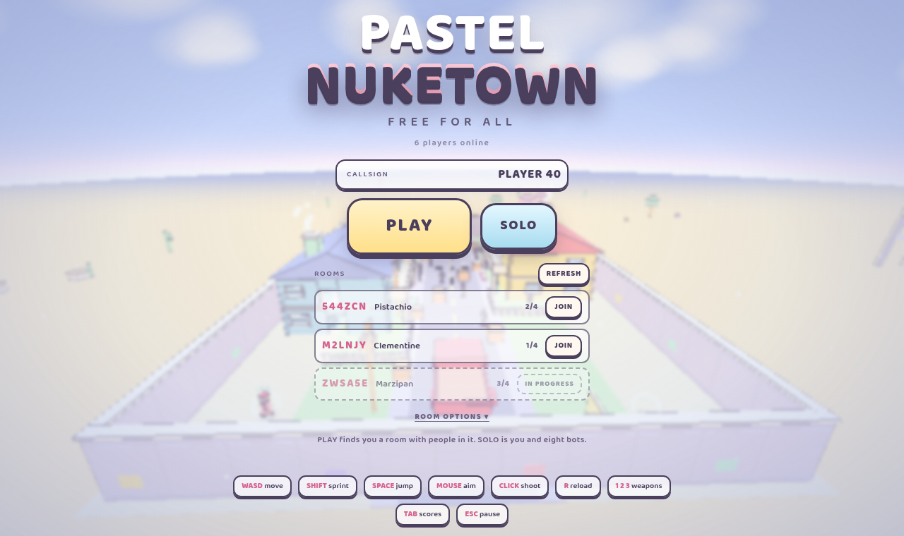
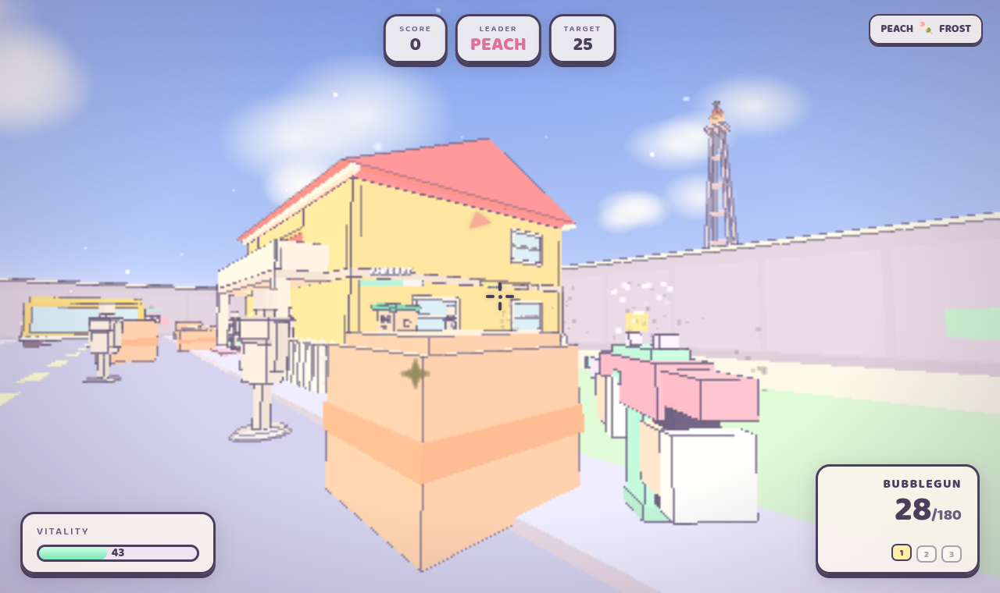

# PASTEL NUKETOWN

A pastel-coloured browser FPS inspired by Nuketown. Free-for-all, first to 25 kills. Play solo against bots or host a multiplayer room for up to 4 players over WebSocket relay.





## Quick start

```bash
npm install
npm start          # builds index.html, then starts the relay on :3000
```

Open `http://localhost:3000` in a modern browser. Click the canvas to lock the pointer and play.

### LAN play

The relay accepts any origin by default, so players on your network can connect at `http://<your-ip>:3000`. To restrict origins in production, see `deploy/provision.sh`.

## Controls

| Input | Action |
|---|---|
| W A S D | Move |
| Mouse | Look |
| Left click | Fire |
| Scroll wheel | Cycle weapon |
| 1 / 2 / 3 | Select BUBBLEGUN / MARSHMALLOW / LOLLIPOP |
| R | Reload |
| Shift | Sprint |
| Space | Jump |
| Tab (hold) | Scoreboard |
| Esc | Release pointer / pause |

## Weapons

| # | Name | Type | Notes |
|---|---|---|---|
| 1 | BUBBLEGUN | SMG | Full-auto, 30-round mag |
| 2 | MARSHMALLOW | Shotgun | 9 pellets, close range |
| 3 | LOLLIPOP | Rifle | Semi-auto, high damage, headshot multiplier |

## Architecture

The game ships as a single `index.html` assembled by `build.sh` from numbered source parts:

```
src/
  00-head.html      <head> styles and meta
  01-body.html      HUD markup
  10-core.js        math utilities, constants
  20-world.js       Three.js scene, map geometry from mapspec.js
  30-physics.js     AABB collision, raycasts, movement
  40-weapons.js     weapon stats, viewmodel, projectiles
  50-actors.js      character models, animation
  60-fx.js          particles, tracers, muzzle flash
  70-game.js        match flow, player control, combat, bot wiring
  75-network.js     multiplayer client (WebSocket, interpolation, prediction)
  80-ui.js          HUD, killfeed, scoreboard, screens
  90-main.js        boot, camera, render loop
```

Shared modules consumed by both client and server:

| File | Purpose |
|---|---|
| `mapspec.js` | Map geometry contract (solids, platforms, stairs, spawns) |
| `net-protocol.js` | Wire format, validation, constants (VERSION, MAX_PLAYERS, etc.) |
| `bots.js` | Navigation mesh + bot AI (easy / normal / hard) |
| `server.mjs` | Host-authoritative WebSocket relay |

`index.html` is a build artefact. Edit files in `src/` and the shared modules, then run `npm run build`.

## Development

```bash
npm run build      # reassemble index.html from src/
npm test           # run the test suite (node --test)
npm run check      # syntax-check every source file + tests + build freshness
```

## Deployment

`deploy/provision.sh` sets up the relay on a fresh Ubuntu 24.04 box (systemd service, nginx, TLS). See the script header for configuration variables.

## Contributing

See [CONTRIBUTING.md](CONTRIBUTING.md) for the full protocol. In short:

- **Bug?** Open an issue with the bug template. Include browser, repro steps, and console output.
- **Feature idea?** Open an issue with the feature template. Explain why it is fun and what it touches.
- **Protocol change?** Open an RFC-style issue first. `net-protocol.js` is a shared contract; do not change it in a drive-by PR.
- **PR?** Run `npm run check` before pushing. One concern per PR.

## License

Private. All rights reserved.
